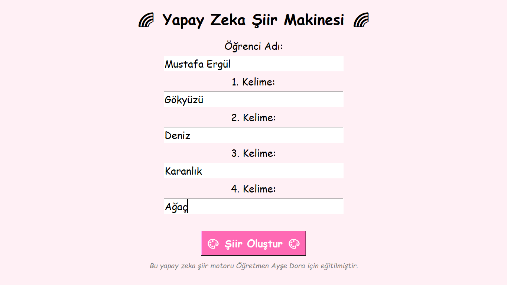
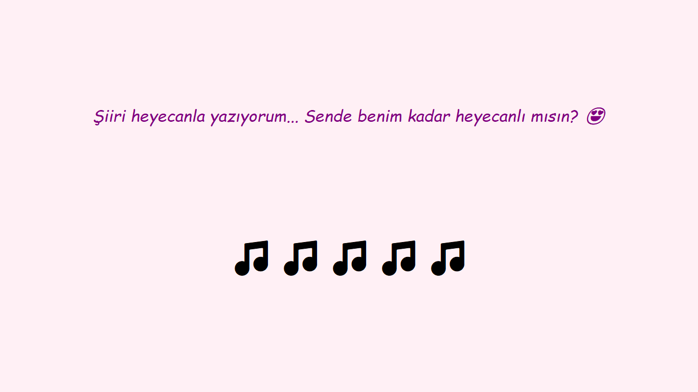
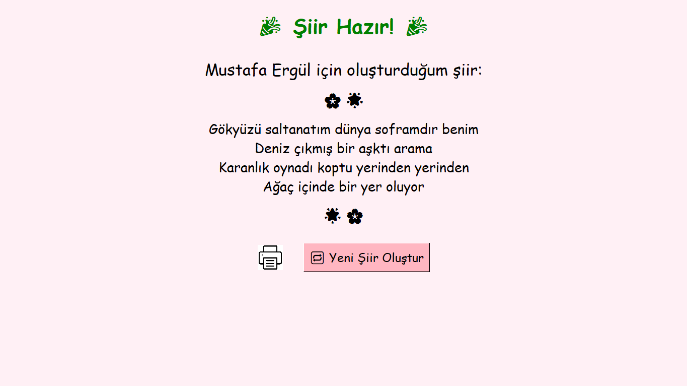

# 📜 ŞiirAI – Yapay Zeka Destekli Türkçe Şiir Üretici

🎓 _Bu uygulama Öğretmen Ayşe Dora için özel olarak geliştirilmiştir._

## ✨ Tanıtım

**ŞiirAI**, verilen dört kelimeye dayanarak yapay zekâ destekli Türkçe dörtlük şiirler üreten interaktif bir uygulamadır. Öğrencilerin hayal gücünü harekete geçirmeyi, Türkçe şiir kültürüne olan ilgiyi artırmayı ve yaratıcı üretimi eğlenceli hale getirmeyi hedefler.

---

## 📷 Ekran Görüntüleri

| Giriş Ekranı | Yükleniyor | Şiir Sonucu |
|-------------|------------|-------------|
|  |  |  |

---

## 🚀 Özellikler

- 🧠 LLM (Large Language Model) destekli şiir üretimi  
- 📝 Öğrencinin adı ve dört kelimeye göre özelleştirilmiş şiir  
- 🎨 Kullanımı kolay ve eğlenceli arayüz  
- 📄 Yazdırılabilir ve PDF’e dönüştürülebilir şiir çıktısı  
- 🧩 2. sınıf ve üzeri tüm yaş grupları için uygun

---

## ⚙️ Teknolojiler

- Python (backend – şiir üretimi)
- PyTorch / Hugging Face (özel şiir modeli)
- Tkinter (arayüz)
- ReportLab (PDF çıktısı için)
- Custom-trained Turkish LLM (`aliarda/Turkish-Poems-19K` veri seti ile eğitildi)

---

## 🛠️ Kurulum

```bash
git clone https://github.com/kullaniciadi/SiirAI.git
cd SiirAI
pip install -r requirements.txt
python main.py
